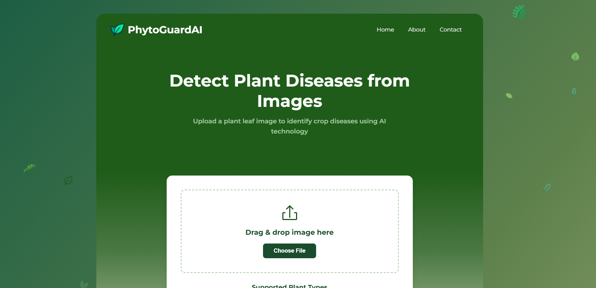

# Crop Disease Prediction Web Application

**Live Application URL:** [https://crop-disease-predictor-45541162153.europe-west1.run.app](https://crop-disease-predictor-45541162153.europe-west1.run.app)
*(Note: This is the URL Google Cloud Run provided. If you set up a custom domain later, update this link.)*

This project is a web application that utilizes a PyTorch-based machine learning model (ResNet50) to identify plant diseases from uploaded leaf images. It features a user-friendly front-end and achieves high accuracy in its predictions, now successfully deployed on Google Cloud Run.

---





---

## Features

*   **AI-Powered Disease Detection:** Upload an image of a plant leaf to receive a prediction of the disease.
*   **Supported Plants (Examples):** Tomato, Potato, Apple, Corn, with potential for future expansion.
*   **High Accuracy Model:** The underlying machine learning model demonstrates 99.65% accuracy on its validation dataset.
*   **Clean & Modern UI:** Designed for ease of use with a simple image upload process.
*   **How It Works:** An integrated section explaining the four-step prediction process to users.
*   **Informative Results:** Displays the predicted disease along with the model's confidence score.
*   **Responsive Design:** Accessible on various devices.

## Technology Stack

*   **Backend:** Python, Flask
*   **Machine Learning Framework:** PyTorch, Torchvision
*   **Model Architecture:** ResNet50 (pre-trained, with a custom classifier head)
*   **Frontend:** HTML5, CSS3, JavaScript
*   **Deployment Platform:** Google Cloud Run
*   **Containerization:** Docker
*   **Build Service:** Google Cloud Build
*   **Container Registry:** Google Artifact Registry
*   **WSGI Server:** Gunicorn

## Project Motivation

This project was born from a desire to apply advanced machine learning techniques, particularly Convolutional Neural Networks (CNNs), to solve a tangible problem in agriculture. As an Agronomy student, bridging the gap between theoretical knowledge and practical AI solutions is a key interest. The goal was to develop an accessible tool that could aid farmers, gardeners, and enthusiasts in the early identification of plant diseases, facilitating quicker responses and potentially improving crop health management.

## Model Details

*   **Architecture:** ResNet50, leveraging pre-trained weights from ImageNet and fine-tuned with a custom classification head for plant diseases.
*   **Training Dataset:** The model was trained on the publicly available [PlantVillage Dataset on Kaggle](https://www.kaggle.com/datasets/abdallahalidev/plantvillage-dataset). This dataset provides a rich collection of leaf images across various plants and disease states. Users are encouraged to test the model using images from this dataset.
*   **Accuracy:** The model achieved an accuracy of 99.65% on the validation set during training.
*   **Classes:** Currently, the model is trained to identify 38 distinct plant/disease combinations.

## Deployment

The application is containerized using Docker and deployed as a serverless application on Google Cloud Run.

*   **`Dockerfile`:** Utilizes a multi-stage build with a `python:3.12-slim-bookworm` base image. It's specifically configured to install CPU-only versions of PyTorch and Torchvision to ensure a lean and efficient production image.
*   **`requirements.txt`:** Lists Python dependencies, with PyTorch/Torchvision versions managed explicitly in the Dockerfile for CPU-only installation.
*   **Google Cloud Build & Artifact Registry:** Used for building the Docker image in the cloud and storing it securely.
*   **Google Cloud Run:** Hosts the container, automatically scales (including to zero), and serves traffic.
*   **Security Note:** For production applications facing public internet traffic, integrating services like Cloudflare for DDoS protection, Web Application Firewall (WAF), and CDN capabilities is a recommended best practice to enhance security and performance.

## Setup and Local Development (Optional)

To run this project locally:

1.  **Clone the repository:**
    ```bash
    git clone https://github.com/idriha360/crop-desease-webapp-V1.git
    cd crop-desease-webapp-V1
    ```
2.  **Create and activate a Python virtual environment:**
    ```bash
    python3 -m venv venv
    source venv/bin/activate  # On Windows: venv\Scripts\activate
    ```
3.  **Install dependencies:**
    ```bash
    pip install -r requirements.txt
    ```
    *(Note: For local development, especially if you have a GPU, you might want to install the appropriate GPU-enabled PyTorch version instead of the CPU version specified for deployment.)*
4.  **Run the Flask application:**
    ```bash
    python app.py
    ```
5.  Open your browser and navigate to `http://127.0.0.1:5000`.

## Future Development Plans

*   Expand the range of supported plant species and diseases.
*   Integrate functionality for assessing disease severity.
*   Provide localized treatment suggestions or links to relevant agricultural resources.
*   Continuously improve model accuracy and robustness on diverse, real-world image conditions.
*   Explore options for a mobile application or an API for easier integration.

## About the Developer

My name is **Haithem Chouari**, and I am currently pursuing my studies in Agronomy at the Institute of Agronomy and Veterinary Medicine Hassan II (IAV). I am passionate about leveraging technology, particularly data science and machine learning, to innovate within the agricultural sector.

*   **LinkedIn:** [https://www.linkedin.com/in/haithem-chouari-34474b331/](https://www.linkedin.com/in/haithem-chouari-34474b331/)
*   **GitHub:** [https://github.com/idriha360](https://github.com/idriha360)

## Acknowledgements

*   Special thanks to **Marine (Web Developer)** and **Yassine Zouhdi (Data Scientist)** ([LinkedIn](https://www.linkedin.com/in/yassine-zouhdi-a63509210/)) for their invaluable reviews, insightful feedback, and support throughout this project.
*   The image dataset used for training was sourced from the PlantVillage project.
*   This project was developed with the assistance of AI tools for guidance and code generation.

---